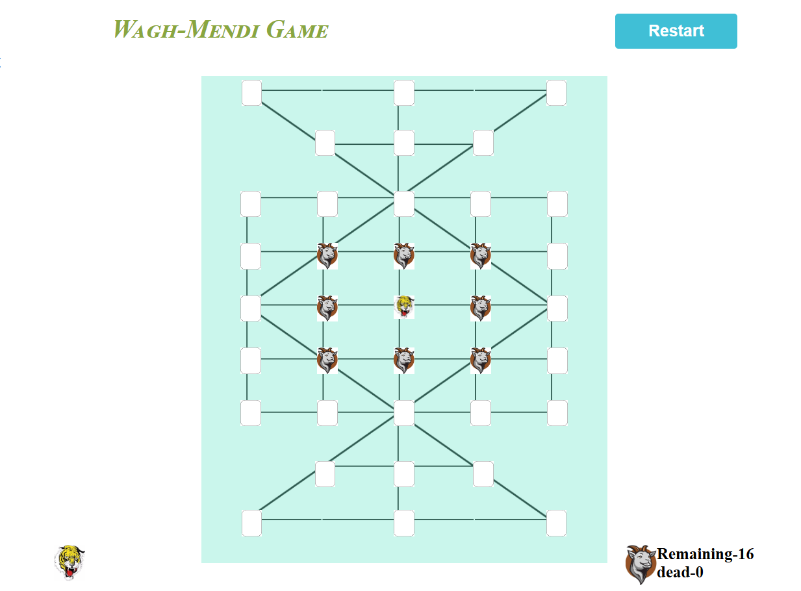
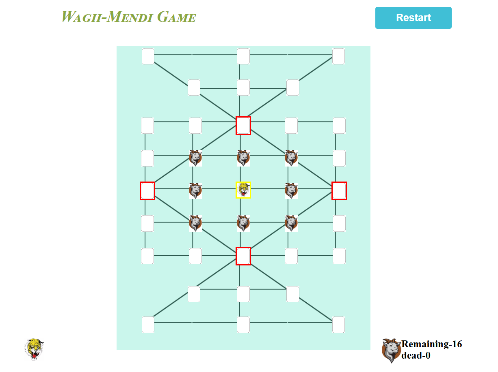
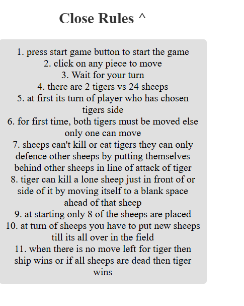

# Wagh-Mendi Game

Welcome to the Wagh-Mendi game! This is an exciting traditional game that tests your strategic thinking and decision-making skills. 

## Table of Contents

- [Game Overview](#game-overview)
- [Rules](#rules)
- [Starting Game State](#starting-game-state)
- [Photos](#photos)
- [Installation](#installation)
- [Contributing](#contributing)
- [License](#license)

## Game Overview

Wagh-Mendi is a traditional strategy game where players aim to outsmart their opponents through careful planning and clever moves. 

## Rules

1. **Setup**: The game is played on a board with a specific layout. Each player has a set number of pieces.
2. **Objective**: The goal is to capture all of your opponent's pieces or to block them so they cannot make any moves.
3. **Gameplay**:
   - Players take turns moving their pieces.
   - Pieces can move in specified directions as per the rules.
   - Players can capture opponent pieces by landing on them.
4. **Winning**: The first player to eliminate all opponent pieces or trap them wins the game.

## Starting Game State



*This image shows the initial layout of the game board before any moves are made.*

## Photos


*This image illustrates the turn of player playing tiger.*



*This image illustrates the rules of the game for easy reference.*

## Installation

To run this game locally, follow these steps:

1. Clone this repository:
   ```bash
   git clone https://github.com/GaneshDevM/wagh-mendi.git

2. Navigate to project directory:
   ```bash
   cd wagh-mendi

3. run game
   ```bash
   node app.js